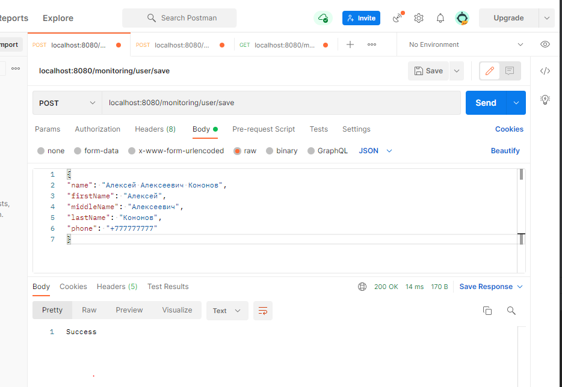
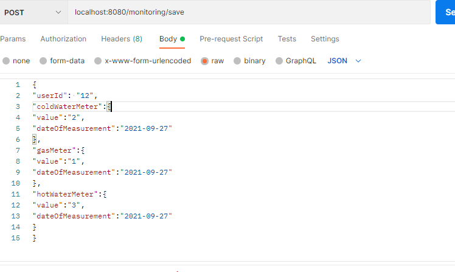
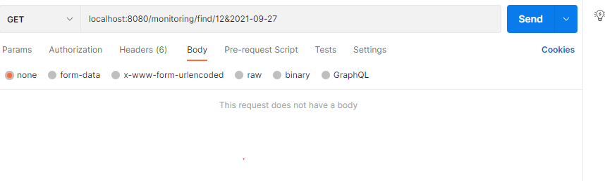

в папке с hsqldb (\hsqldb-2.6.0\hsqldb) создать файл server.properties со следующим содержимым:

server.database.0 = file:hsqldb/monitoringDB
server.dbname.0 = monitoring

Запустить из консоли команды:
1. java -classpath lib/hsqldb.jar org.hsqldb.server.Server --database.0
2. java -classpath lib/hsqldb.jar org.hsqldb.server.Server --database.0 file:hsqldb/monitoringDB --dbname.0 monitoring

Создание пользователя:
Post  localhost:8080/monitoring/user/save 

Body example:
{
"name": "Алексей Алексеевич Кононов",
"firstName": "Алексей",
"middleName": "Алексеевич",
"lastName": "Кононов",
"phone": "+777777777"
}

Просмотр всех пользователей:
Get localhost:8080/monitoring/user/find-all

Заливка измерений:
Post localhost:8080/monitoring/save
Передаём json с айди пользователя + метрики(гор\хол вода, газ)где нужно указать значение счётчика + дату

Body example:
{
"userId": "12",
"coldWaterMeter":{
"value":"2",
"dateOfMeasurement":"2021-09-27"
},
"gasMeter":{
"value":"1",
"dateOfMeasurement":"2021-09-27"
},
"hotWaterMeter":{
"value":"3",
"dateOfMeasurement":"2021-09-27"
}
}

Запрос метрик:
Get localhost:8080/monitoring/find/{id}&{date} 
Example:
localhost:8080/monitoring/find/12&2021-09-27
